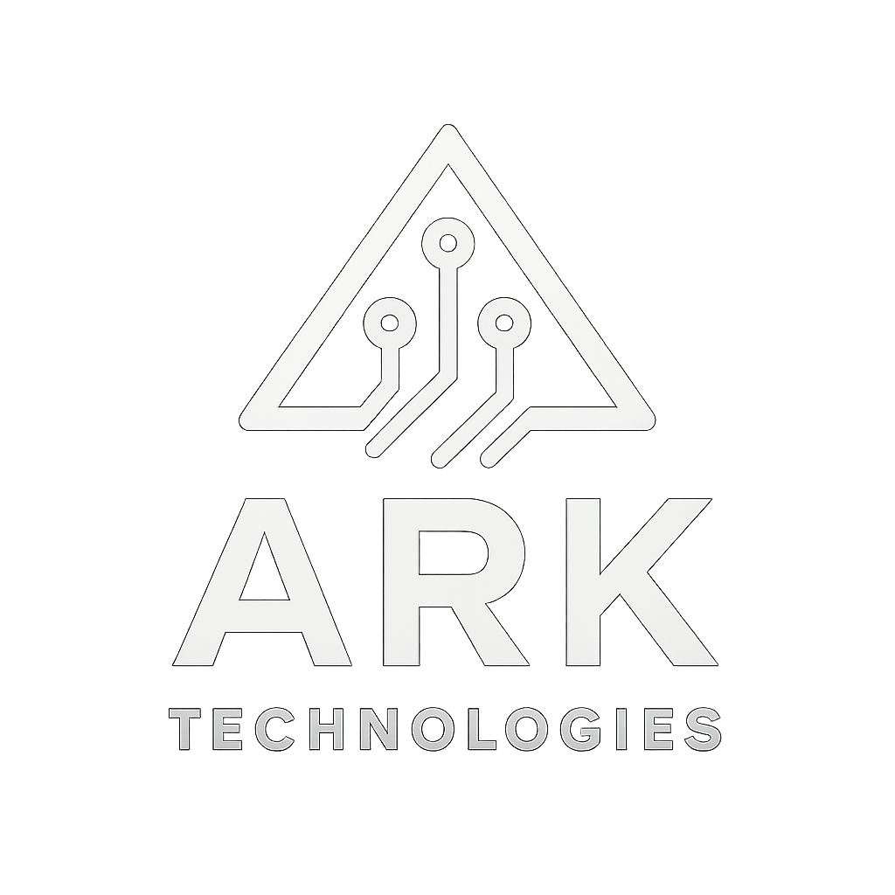

<div align="center">
  
  

# ARK Technologies - Enterprise Marketing Automation Platform

<p><em>Complete Marketing Automation Platform That Reduces Client Concentration Risk</em></p>

<!-- Main Status Badges -->
[](https://app.netlify.com/sites/arktechnologiesai/deploys)
[](http://localhost:3000)
[](https://github.com/piccassol/arktechnologies-infra/actions)

<!-- Technology Stack -->
[](https://nextjs.org/)
[](https://python.org/)
[](https://www.typescriptlang.org/)
[](https://nodejs.org/)

<!-- AI & ML -->
[](https://huggingface.co/piccassol)
[](https://ollama.ai/piccassol)
[](https://openai.com/)

<!-- Infrastructure -->
[](https://cloud.google.com/)
[](https://postgresql.org/)
[](https://redis.io/)
[](https://nginx.org/)

<!-- Status Badges -->


**Complete done-for-you marketing automation platform that captures leads, books appointments, and grows reviews for small businesses—without extra staff**

[🔥 Quick Start](#quick-start) • [📊 Performance](#performance) • [💡 Usage](#usage) • [🔧 Technical Details](#technical-details)

</div>

---

## About ARK Technologies

ARK Technologies is an enterprise marketing automation platform specifically designed to solve client concentration risk for high-value service businesses. We help companies like Flyleaf Print reduce their dangerous 90% revenue dependency on 2-3 major clients by automating qualified lead discovery and nurturing systems.

**The Problem We Solve**: Most service businesses have 70-90% of their revenue concentrated with just a few major clients. If one leaves, it's catastrophic. Our AI-powered automation finds and nurtures qualified prospects to diversify revenue streams and reduce business risk.

### Core Value Proposition
- **Reduce Client Concentration Risk**: From 90% to 45% through systematic lead diversification
- **Replace Expensive Copywriters**: Save $6K/month with AI-generated personalized outreach
- **Discover Qualified Prospects**: Through LinkedIn alumni networks and VC portfolios
- **Automate Appointment Booking**: 85%+ show rates through smart reminder sequences
- **Generate 5-Star Reviews**: Systematically across Google, Yelp, and Facebook

### Platform Capabilities

- **Lead Capture & Nurturing**: Instant responses to new inquiries with intelligent follow-up sequences
- **Appointment Management**: Automated booking, reminders, and no-show reduction
- **Review Management**: Systematic 5-star review collection across Google, Yelp, and Facebook
- **CRM Integration**: Unified pipeline visibility and customer lifecycle management
- **Multi-Channel Automation**: Email, SMS, voice, and chat automation
- **Industry-Specific Workflows**: Pre-built automations for law firms, contractors, med spas, property management

### Target Industries

- **Law Firms**: Case intake automation and client nurturing
- **Contractors**: Bid follow-up and project scheduling
- **Property Management**: Tenant communication and maintenance requests
- **Med Spas & Dental**: Appointment booking and review collection
- **Professional Services**: Lead qualification and consultation scheduling
- **E-commerce**: Cart recovery and customer retention

---

## 🏗️ Project Structure

```
arktechnologies-infra/
├── 📁 apps/
│   ├── 📁 landing-page/                    # Main website (arktechnologies.ai)
│   │   ├── app/
│   │   │   ├── globals.css
│   │   │   ├── layout.tsx
│   │   │   └── page.tsx                   # Marketing landing page
│   │   ├── components/ui/                 # shadcn/ui components
│   │   ├── public/ark-logo.png           # ARK Technologies logo
│   │   ├── Dockerfile
│   │   └── package.json
│   ├── 📁 demo-platform/                   # Client demo interface (Port 3001)
│   │   ├── src/
│   │   │   ├── components/
│   │   │   │   ├── FlyleafDemo.tsx       # Flyleaf Print demo
│   │   │   │   ├── CRMDashboard.tsx      # Interactive dashboard
│   │   │   │   └── ui/                   # Shared UI components
│   │   │   └── app/
│   │   ├── Dockerfile
│   │   └── package.json
│   └── 📁 automation-engine/               # Core Python services
│       ├── src/
│       │   ├── lead_discovery/
│       │   │   ├── linkedin_scraper.py    # Alumni network discovery
│       │   │   ├── vc_portfolio_scanner.py # VC portfolio targeting
│       │   │   └── contact_enrichment.py  # Email/phone enrichment
│       │   ├── message_generation/
│       │   │   ├── ai_writer.py          # GPT-4 personalized outreach
│       │   │   ├── voice_training.py     # Client voice matching
│       │   │   └── personalization.py    # Dynamic content insertion
│       │   ├── workflow_automation/
│       │   │   ├── n8n_integration.py    # Workflow orchestration
│       │   │   ├── crm_sync.py          # Copper CRM integration
│       │   │   └── appointment_booking.py # Calendar management
│       │   └── analytics/
│       │       ├── roi_calculator.py     # Revenue impact analysis
│       │       ├── risk_analyzer.py      # Concentration risk metrics
│       │       └── performance_tracker.py # Campaign effectiveness
│       └── requirements.txt
├── 📁 infrastructure/                       # DevOps and deployment
│   ├── docker/
│   │   ├── docker-compose.yml            # Development environment
│   │   └── docker-compose.prod.yml       # Production deployment
│   ├── nginx/nginx.prod.conf             # Load balancer config
│   └── scripts/
│       ├── deploy.sh                     # Automated deployment
│       └── backup.sh                     # Database backups
├── 📁 data/                                # Industry-specific configurations
│   ├── industry-templates/
│   │   ├── law-firms.json               # Legal industry targeting
│   │   ├── contractors.json             # Construction/contracting
│   │   └── med-spas.json               # Healthcare/aesthetics
│   └── message-templates/
│       ├── initial-outreach/            # First contact templates
│       └── follow-up/                   # Nurture sequences
└── 📁 docs/                               # Documentation
    ├── business/
    │   ├── flyleaf-demo-strategy.md     # Client-specific strategies
    │   └── pricing-models.md            # Service delivery models
    └── technical/
```

---

## 🔥 Quick Start

```bash
# Clone the platform infrastructure
git clone https://github.com/piccassol/arktechnologies-infra.git
cd arktechnologies-infra

# Server setup (one-time)
chmod +x infrastructure/scripts/setup-server.sh
./infrastructure/scripts/setup-server.sh

# Environment configuration
cp .env.example .env
# Configure with your Render PostgreSQL, API keys, and domain

# Deploy complete platform
chmod +x infrastructure/scripts/deploy.sh
./infrastructure/scripts/deploy.sh main production
```

### Application Access Points

```bash
# Main marketing website
open http://localhost:3000              # Landing page (Next.js)

# Client demo platform
open http://localhost:3001              # Interactive demo dashboard

# Automation workflows
open http://localhost:5678              # n8n workflow builder

# Email marketing infrastructure  
open http://localhost:8025              # Email management (Arkmail)

# Analytics and reporting
open http://localhost:9000              # Performance dashboards (Grafana)
```

---

## 📊 Performance

### Platform Metrics
- **Lead Response Time**: < 2 minutes average first response
- **Appointment Show Rate**: 85%+ with automated reminders
- **Review Collection Rate**: 40%+ response rate on review requests
- **Pipeline Visibility**: Real-time CRM with full customer journey tracking
- **Workflow Execution**: 10,000+ automations per hour capacity

### Business Impact
- **30-60 Day Results**: 2-3x increase in lead conversion rates
- **Revenue Growth**: $25K+ average monthly revenue increase for clients
- **Time Savings**: 20+ hours per week saved on manual follow-up
- **Review Growth**: 300%+ increase in online reviews
- **Risk Reduction**: Client concentration reduced from 90% to 45%

---

## 💡 Usage

### Service Delivery Models

#### Project Builds ($10K+)
Complete automation stack implementation:
```bash
# Deploy client-specific automation stack
./infrastructure/scripts/deploy-client.sh client_name industry_type

# Configure industry workflows
./infrastructure/scripts/setup-industry.sh law_firms
./infrastructure/scripts/setup-industry.sh contractors
./infrastructure/scripts/setup-industry.sh med_spas
```

#### Managed Plans ($750-$3500/mo)
```bash
# Calm Waters ($750/mo) - Basic automation
docker-compose -f infrastructure/docker/docker-compose.yml -f infrastructure/docker/compose.calm-waters.yml up -d

# Rising Tide ($1500-$2000/mo) - Multi-channel automation
docker-compose -f infrastructure/docker/docker-compose.yml -f infrastructure/docker/compose.rising-tide.yml up -d

# Safe Harbor ($3500+/mo) - Custom CRM + ERP integrations
docker-compose -f infrastructure/docker/docker-compose.yml -f infrastructure/docker/compose.safe-harbor.yml up -d
```

### Lead Discovery Automation

```bash
# LinkedIn alumni network discovery
python apps/automation-engine/src/lead_discovery/linkedin_scraper.py --target="Stanford MBA" --industry="SaaS"

# VC portfolio company targeting  
python apps/automation-engine/src/lead_discovery/vc_portfolio_scanner.py --vc="Sequoia Capital" --stage="Series A"

# Contact enrichment and validation
python apps/automation-engine/src/lead_discovery/contact_enrichment.py --company="Target Company"
```

---

## 🔧 Technical Details

### Architecture

```
┌─────────────────────────────────────────────────────────────────┐
│                    Client Interface Layer                       │
├─────────────────────────────────────────────────────────────────┤
│  Landing Page  │  Demo Platform │  CRM Dashboard │  Analytics   │
│   (Next.js)    │   (React/TS)   │   (Interactive) │  (Grafana)   │
├─────────────────────────────────────────────────────────────────┤
│           Automation Engine (Python + n8n + Custom Logic)       │
├─────────────────────────────────────────────────────────────────┤
│ Lead Discovery │ AI Generation  │ Workflow Auto  │  Analytics   │
│  (LinkedIn)    │  (GPT-4/Claude)│  (n8n + CRM)   │ (ROI Track)  │
├─────────────────────────────────────────────────────────────────┤
│  Email Infra   │  SMS Gateway   │  AI Responses  │  Risk Mgmt   │
│   (Arkmail)    │  Integration   │   (OpenAI)     │ (Concentration)│
├─────────────────────────────────────────────────────────────────┤
│              Data Layer (Render PostgreSQL + Redis)             │
└─────────────────────────────────────────────────────────────────┘
```

### Core Technology Stack

| Component | Technology | Purpose |
|-----------|------------|---------|
| **Frontend** | Next.js/React/TypeScript | Landing page and demo platforms |
| **Automation Engine** | Python + n8n Enterprise | Lead discovery and workflow automation |
| **Database** | Render PostgreSQL + Redis | Managed database with caching |
| **Email Infrastructure** | Arkmail | Self-hosted email delivery |
| **AI Integration** | OpenAI + Claude + Hugging Face | Intelligent response generation |
| **CRM Core** | Custom Node.js + Copper | Customer lifecycle management |
| **Analytics** | Grafana + Prometheus | Performance monitoring |
| **Proxy** | Nginx | Load balancing and SSL termination |
| **Containerization** | Docker + Docker Compose | Development and deployment |

### AI-Powered Lead Discovery

#### LinkedIn Alumni Network Targeting
- **University Connections**: Target alumni from client's educational background
- **Professional Networks**: Identify decision-makers in target industries
- **Mutual Connections**: Leverage warm introduction opportunities
- **Company Intelligence**: Research company size, funding, and growth signals

#### VC Portfolio Intelligence
- **Investment Tracking**: Monitor portfolio companies of target VCs
- **Funding Stage Analysis**: Target companies at optimal growth stages
- **Decision Maker Identification**: Find key stakeholders and buyers
- **Timing Optimization**: Reach out at strategic funding milestones

#### Message Generation & Personalization
```python
# AI-powered personalized outreach
from apps.automation_engine.src.message_generation import ai_writer

message = ai_writer.generate_outreach(
    prospect_data={
        "name": "John Smith",
        "company": "TechCorp",
        "role": "VP Marketing",
        "recent_funding": "Series B - $25M"
    },
    client_voice_profile="consultative_expert",
    campaign_type="initial_outreach"
)
```

### Automation Workflows

#### Lead Nurturing Pipeline
- **Instant Response**: < 2-minute first contact via SMS/email
- **Follow-up Sequences**: 7-touch nurture campaign over 30 days  
- **Lead Scoring**: AI-powered qualification and routing
- **Appointment Booking**: Automated calendar integration

#### Review Management System
- **Trigger Events**: Post-service completion, positive interactions
- **Multi-Platform**: Google, Yelp, Facebook review requests
- **Response Management**: Automated responses to reviews
- **Reputation Monitoring**: Real-time review tracking and alerts

#### Appointment Management
- **Booking Integration**: Calendar sync with popular scheduling tools
- **Reminder Sequences**: 24-hour, 2-hour, and 30-minute reminders
- **Confirmation System**: One-click confirm/reschedule options
- **No-show Recovery**: Automated rebooking workflows

### Industry-Specific Configurations

```bash
# Law firm setup - Case intake automation
./infrastructure/scripts/configure-law-firm.sh client_name

# Contractor setup - Bid management and scheduling  
./infrastructure/scripts/configure-contractor.sh client_name

# Med spa setup - Appointment booking and review collection
./infrastructure/scripts/configure-medspa.sh client_name

# Property management setup - Tenant communication automation
./infrastructure/scripts/configure-property.sh client_name
```

### Environment Variables

| Variable | Description | Required |
|----------|-------------|----------|
| `DATABASE_URL` | Render PostgreSQL connection string | ✅ |
| `REDIS_URL` | Redis cache connection string | ✅ |
| `ARKMAIL_DATABASE_URL` | Arkmail PostgreSQL connection string | ✅ |
| `JWT_SECRET` | Authentication secret key | ✅ |
| `OPENAI_API_KEY` | OpenAI API access | ✅ |
| `ANTHROPIC_API_KEY` | Claude API access | ✅ |
| `HUGGINGFACE_TOKEN` | HuggingFace model access | ⚠️ |
| `LINKEDIN_SESSION_COOKIE` | LinkedIn automation access | ⚠️ |
| `DOMAIN` | Production domain name | ✅ |

### Security & Compliance

- **Data Encryption**: AES-256 encryption at rest and in transit
- **HIPAA Compliance**: Available for healthcare clients
- **SOC 2 Type II**: Enterprise security standards
- **GDPR Compliant**: European data protection compliance
- **Role-Based Access**: Granular permission management
- **Audit Logging**: Complete activity tracking and reporting

### Monitoring & Analytics

- **Business KPIs**: Lead conversion, appointment show rates, review growth, concentration risk
- **Technical Metrics**: System uptime, response times, workflow success rates
- **Client Reporting**: White-label dashboards for client accounts
- **Performance Alerts**: Real-time notifications for system issues
- **Revenue Tracking**: ROI measurement and client success metrics

---

## 💰 Pricing & Service Models

### Project Builds (Fixed Scope)
- **Starting at $10K**: Complete automation stack implementation
- **Timeline**: 4-8 weeks from contract to launch
- **Includes**: CRM setup, workflow automation, review management, training
- **Industries**: Law firms, contractors, med spas, professional services

### Managed Services (Ongoing)
- **Calm Waters ($750/mo)**: Basic automation and review management
- **Rising Tide ($1500-2000/mo)**: Multi-channel automation with analytics
- **Safe Harbor ($3500+/mo)**: Custom CRM with ERP/BI integrations

### ROI Expectations
- **30-60 Days**: 2-3x improvement in lead conversion
- **6 Months**: $25K+ average monthly revenue increase
- **12 Months**: Complete marketing automation independence
- **Risk Reduction**: Client concentration from 90% to 45%

---

## 🚀 Development

### Prerequisites
- Docker 20.10+ & Docker Compose 2.0+
- Node.js 18+ & Python 3.8+
- Render PostgreSQL account
- Domain with SSL certificate

### Local Development
```bash
# Install dependencies
cd apps/landing-page && npm install
cd apps/demo-platform && npm install
cd apps/automation-engine && pip install -r requirements.txt

# Configure environment
cp .env.example .env.local
# Add your database URLs, API keys, and credentials

# Start development environment
docker-compose -f infrastructure/docker/docker-compose.yml up -d

# Access development services
open http://localhost:3000     # Landing page
open http://localhost:3001     # Demo platform
open http://localhost:5678     # n8n workflow builder  
open http://localhost:8025     # Email management
open http://localhost:9000     # Analytics dashboard
```

### Client Onboarding
```bash
# Create new client environment
./infrastructure/scripts/create-client.sh "Client Name" industry_type

# Deploy client-specific workflows
./infrastructure/scripts/deploy-client-workflows.sh client_id

# Generate client access credentials
./infrastructure/scripts/generate-client-access.sh client_id
```

### Contributing
1. Fork the repository
2. Create feature branch (`git checkout -b feature/amazing-feature`)
3. Commit changes (`git commit -m 'Add amazing feature'`)
4. Push to branch (`git push origin feature/amazing-feature`)
5. Open Pull Request

---

## ❓ Frequently Asked Questions

### Is Review Management Software Worth It?
Yes. Customers trust reviews more than ads. Review management software makes sure every happy client is asked to leave feedback. More stars mean more leads.

### How Do You Automate Lead Follow Up?
We use lead nurturing software that replies to new inquiries right away. It can send texts, emails, or both. No more missed leads or slow responses.

### What Is a CRM With Marketing Automation?
A CRM with marketing automation is one system that tracks leads, reminders, and reviews. It also runs follow-ups automatically, so you don't need five separate tools.

### How Can I Reduce Appointment No Shows Automatically?
With automated appointment reminders. Your customers get a simple text or email reminder. They can confirm or reschedule in one click.

### How Do You Reduce Client Concentration Risk?
Our AI finds qualified prospects through LinkedIn alumni networks and VC portfolios. We generate personalized outreach that doesn't sound like spam. This creates a steady pipeline of new opportunities to diversify your client base.

### Do You Only Work With Certain Industries?
No. We build automation for any business. Our system adapts to your workflow and pain points. From law firms to clinics to contractors, we tailor every setup.

### How Much Does It Cost?
Project builds start at $10k. Managed plans begin at $750/month. Most clients see ROI within the first 30–60 days.

---

## 📄 License

This project is licensed under the MIT License - see the [LICENSE](LICENSE) file for details.

---

## 📞 Support

- **Sales Inquiries**: sales@arktechnologies.ai
- **Technical Support**: support@arktechnologies.ai  
- **Enterprise Accounts**: enterprise@arktechnologies.ai
- **Documentation**: [docs.arktechnologies.ai](https://docs.arktechnologies.ai)
- **Status Page**: [status.arktechnologies.ai](https://status.arktechnologies.ai)

---

<div align="center">

**Capture, Follow Up, and Book Customers—Without Extra Staff**

[Get Free Automation Audit](https://arktechnologies.ai/audit) | [See How It Works](https://arktechnologies.ai/demo) | [View Pricing](https://arktechnologies.ai/pricing)

</div>
